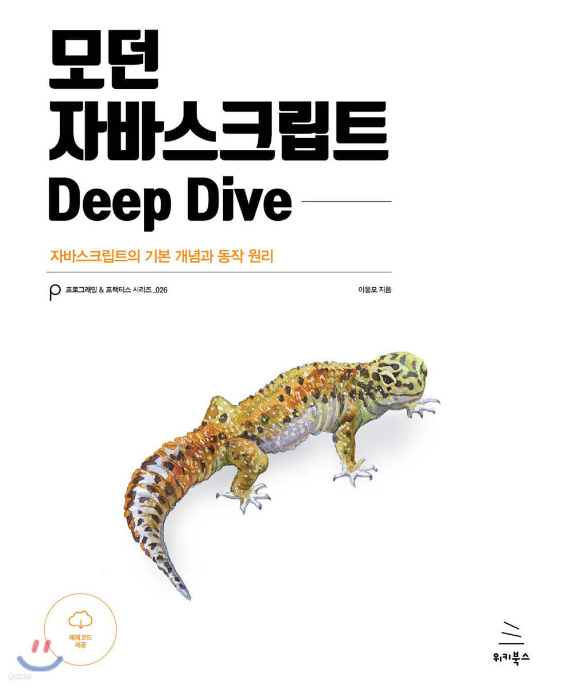

## 📚 JavaScript Deep Dive Study


『모던 자바스크립트 Deep Dive』 책을 기반으로 <br/>
자바스크립트의 동작 원리를 깊이 있게 학습하는 스터디 입니다.<br/>
챕터별 발표 및 토론을 통해 이해를 다지고, 실습을 통해 개념을 내 것으로 만들어갑니다.

<br/>
<br/>

## ✅ 목표
- 남들이 잘 모르는 자바스크립트의 동작 원리 정확히 이해하기
- 언어 하나를 제대로 마스터하기
- 머리속에 자바스크립트 생태계 만들기
- 함께 성장하는 스터디 문화 만들기
- 국물까지 싹싹 긁어 완독하기

- 👁️ 이 스터디 이후 우리는.. 👁️

1. var가 너무 무서워서 var를 사용한 프로그램을 유지보수하는 꿈을 꾸게 됩니다.
2. react 전역 스토어 라이브러리에서 발생하는 TypeError: Cannot assign to read only property 와 같은 에러를 발생시킬 수 있습니다.
	```ts
		const [object, setObject] = useRecoilState(textState); 
		object.test = "새로운 값" //TypeError: Cannot assign to read only property
	```
3. 화살표 함수를 쓰지 말아야 할 때가 있음을 이해합니다. (feat. fabric.js 문서)
	 > The handlers are called bound on the instance, so in the handler function the `this` is either the fabric object or the fabric canvas.
   > Fat arrow functions can't be bound to anything else than the context in which they were created,
   > so if you don't want unexpected side effects use functions for event handlers.

4. 그 외 자바스크립트에 존재하는지도 몰랐던 다양한 현상과 api들을 알게 됩니다. 
	1. wrapper객체..
	2. 제너레이터
	3. prototype에 대한 딥다이브
	4. 변수, 함수의 평가 과정
	5. 암묵적 타입 변환의 무서움

그 외 많은걸 알게 됨..


<br/>
<br/>

## 🗓 진행 방식
- 주 1회 온라인 스터디
- 발표자 중심의 챕터 리뷰 + 토론
- 실습 과제 및 코드 리뷰

<br/>
<br/>

## 진행 기간
2025.3.26 ~ 

<br/>
<br/>
