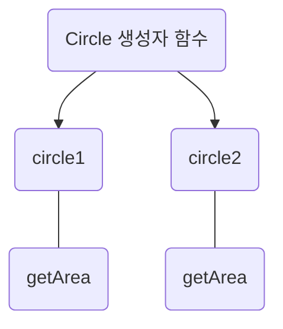
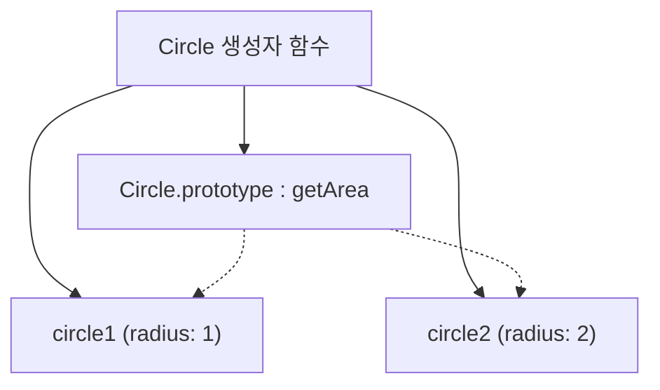

# 프로토타입 = 원형, 견본

```js
const person = {
	name : 'Kim',
	address : 'Seoul',
	walk () {
		console.log('뚜벅뚜벅')
	}
};
```

👉 **객체**
- 자바스크립트에서 <u>원시 타입</u>의 값을 제외한 나머지 값들은 모두 객체다.
- 객체는 상태 데이터와 동작을 하나의 논리적인 단위로 묶는 복합적인 자료구조라 할 수 있다.
- 이때 객체의 상태 데이터를 "프로퍼티", 동작을 "메서드"라 부른다.


---

## 상속과 프로토타입

👉 자바스크립트는 프로토타입을 기반으로 상속을 구현한다.

```js
function Circle(radius){
	this.radius = radius;
	this.getArea = function () {
		return Math.PI * this.radius ** 2;
	}
}

const circle1 = new Circle(1);
const circle2 = new Circle(2);

console.log(circle1.getArea === circle2.getArea); //false

```

🧐 **위 코드의 문제** :
- Circle 인스턴스가 생성될 때 마다 <u>getArea 메서드가 중복 생성</u>된다.
	👉 메모리 낭비
	👉 인스턴스 생성할 때마다 메서드 생성해서 퍼포먼스에도 안좋음




- 프로퍼티는 일반적으로 인스턴스마다 다른 값을 가지지만,
- 메서드는 인스턴스가 동일한 내용의 메서드를 사용하므로 단 하나만 생성하여 인스턴스가 공유하는 것이 바람직하다.


## 프로토타입 객체 활용

위 코드의 문제를 해결한 코드다. 
자바스크립트 엔진이 아래 코드를 어떤 순서로 실행하는지 알아보자.

```js
function Circle(radius){
	this.radius = radius;
}

Circle.prototype.getArea = function(){
	return Math.PI * this.radius ** 2;
}

const circle1 = new Circle(1);
const circle2 = new Circle(2);

console.log(circle1.getArea === circle2.getArea); //true
```

1. 자바스크립트는 `Circle`이라는 이름의 함수 객체를 메모리에 생성함.
2. 이때 
	- `Circle.prototype` 객체를 생성하고 (`{}`)
	- 그 안에 `constructor`를 설정함 (`Circle.prototype.constructor === Circle)
```js
typeof Circle // "function"

Circle.prototype = {} // ✅ 자동 생성된 객체
Circle.prototype.constructor === Circle // ✅ 기본 연결
```

3. `Circle.prototype` 객체는 이미 메모리에 존재하고 있음. 그 객체에 `getArea`라는 프로퍼티를 추가함
```js
Circle.prototype = {
  constructor: Circle,
  getArea: function () { ... }
}
```

4. `const circle1 = new Circle(1);` 평가 시
	-  `new` 키워드가 다음 과정을 실행 :
		1. 빈 객체 생성 → {}
		2. 빈 객체의 `[[Prototype]]`을 Circle.prototype으로 설정
		3. 생성자 함수 Circle을 호출하고, this를 위 빈 객체로 바인딩
		4. this.radius = 1 실행됨 → { radius: 1 }
		5. 객체 반환
5. 결과적으로 `circle.getArea()`는 `circle1`에 없으니 `__proto__`(=prototype체인)을 따라 올라가서 실행됨.





👉 메모리 구조 시각화
```
[Circle 함수]
 ├─ .prototype = {
 │    getArea: function,
 │    constructor: Circle
 │ }
 └─ [[Prototype]] = Function.prototype

[circle1 인스턴스]
 ├─ radius: 1
 └─ [[Prototype]] → Circle.prototype

[circle2 인스턴스]
 ├─ radius: 2
 └─ [[Prototype]] → Circle.prototype
```


---


## `[[Prototype]]`

👉 모든 객체는 `[[Prototype]]`이라는 내부 슬롯을 가진다.
👉 이 내부 슬롯의 값은 프로토타입의 참조 즉 링크다. (참조가 없다면 null)

`[[Prototype]]`에 저장되는 프로토타입은 객체 생성 방식에 의해 결정된다 :
- <u>객체 리터럴에 의해 생성</u>된 객체의 프로토타입은 `Object.prototype`
- <u>생성자 함수에 의해 생성</u>된 객체의 프로토타입은 생성자 함수의 `prototype` 프로퍼티에 바인딩되어 있는 객체

예) 객체 리터럴에 의해 생성된 경우
```js
const obj = {};
console.log(Object.getPrototypeOf(obj)); // → Object.prototype 객체
```

예) 생성자 함수에 의해 생성된 경우
```js
function Circle(radius){
	this.radius = radius;
}

Circle.prototype.getArea = function(){
	return Math.PI * this.radius ** 2;
}

const circle1 = new Circle(1);
console.log(Object.getPrototypeOf(circle1)); // → Circle.prototype 객체
```


## `__proto__` 접근자 프로퍼티

👉 모든 객체는 `__proto__` 접근자 프로퍼티를 통해 자신의 프로토타입, 
즉 `[[Prototype]]` 내부 슬롯에 간접적으로 접근할 수 있다.
사실 `Object.getPrototypeOf`을 사용한 것과 같은 값을 리턴한다.
다만 이제 `__proto__`를 사용하는건 비표준, `Object.getPrototypeOf`가 표준임

```js
function Circle(radius){
	this.radius = radius;
}

Circle.prototype.getArea = function(){
	return Math.PI * this.radius ** 2;
}

const circle1 = new Circle(1);
const circle2 = new Circle(2);
console.log(circle1.__proto__) // Circle.prototype 객체
console.log(circle1.__proto__.__proto__) // Object.prototype 객체
```


`__proto__` 프로퍼티는 접근자 프로퍼티이기 때문에 <u>getter, setter를 가지고 있다</u>.
이를 통해 객체의 prototype을 갈아치울 수 있다.

```js
const person = {};

// setter 호출
circle1.__proto__ = person;


// getter 호출
console.log(circle1.__proto__); // {}

```

---

## `.prototype` vs `.__proto__`

이쯤 오면 이 두가지가 헷갈린다.
하나씩 살펴보자.

1. `.prototype`
- 함수(생성자 함수)에만 존재하는 속성
- 그 함수로 `new`를 호출할 때 만들어질 인스턴스가 상속받을 메서드/속성들을 모아놓은 객체
```js
function Circle(radius) {
  this.radius = radius;
}
Circle.prototype.getArea = function () {
  return Math.PI * this.radius ** 2;
};
```
-  여기서 `Circle.prototype`은 모든 Circle 인스턴스가 공유하는 부모 객체 역할을 함


2. `.__proto__`
- 링크를 참조하는 접근자 프로퍼티.
- 이 링크는 객체가 상속을 위해 참조하고 있는 부모 객체를 가리킴
```js
const circle1 = new Circle(1);
console.log(circle1.__proto__ === Circle.prototype); // true
```

#### `.prototype` vs `.__proto__` 관계 정리
```
circle1 (인스턴스)
 └── __proto__ → Circle.prototype
                     ↑
               new Circle() 호출 시 자동 연결됨
```

- 생성자 함수 `Circle`의 `.prototype`은 `circle1`인스턴스의 `__proto__`가 참조하게 되는 객체
- `__proto__`는 상속을 위한 내부 연결, `.prototype`은 그 연결의 "타겟"

👉 자바스크립트 엔진은 객체의 프로퍼티(메서드 포함)에 접근하려고 할 때
해당 객체에 접근하려는 프로퍼티가 없다면 
`__proto__` 접근자 프로퍼티가 가리키는 참조를 따라 
자신의 부모 역할을 하는 프로토타입의 프로퍼티를 순차적으로 검색.
프로토타입 체인의 종점, 즉 프로토타입 체인의 최상위 객체는 `Object.prototype`이며,
이 객체의 프로퍼티와 메서드는 모든 객체에 상속된다.

---

## 🧠 퀴즈타임
##### 1. 자바스크립트 최상위 객체인 `Object.prototype`의 `__proto__`는 무엇일까?

<details>
  <summary>
    답
  </summary>
  null
</details>


##### 2. `dog.__proto__`는 무엇과 같을까?
```js
function Animal() {}
const dog = new Animal();

console.log(dog.__proto__ === ?); // ❓
```
1. `Animal.prototype`
2. `Object.prototype`
3. `Function.prototype`
4. `Animal.__proto__`

<details>
  <summary>
    답
  </summary>
  1. Animal.prototype
</details>


##### 3. `dog.prototype.__proto__` 는 무엇과 같을까?
```js
function Animal() {}
Animal.prototype = function(){}
const dog = new Animal();

console.log(dog.prototype.__proto__ === ? ) // ❓
```

1. `Object.prototype`
2. `Function.prototype`
3. `Object.__proto__`
4. `Animal.__proto__`

<details>
  <summary>
    답
  </summary>
  1. Object.prototype
</details>
---
3번문제의 함정

Animal.prototype에 함수를 넣음으로써 Animal.prototype은 함수가 됨
원래라면 dog.prototype은 undefined이다. prototype객체는 함수만 가질 수 있기 때문.
그런데 dog이 함수를 상속받음으로써 `dog.__proto__`가 함수를 가리키기 때문에
그 함수가 가지고 있는 **`prototype`이라는 기본 속성**이 `dog.prototype`처럼 보이는 것 뿐임.
그리고 함수가 가지는 prototype은 객체이기 때문에 그의 `__proto__`는 Object.prototype이 되는 것.

---


##### 4. 함수 객체 `Cat`의 `[[Prototype]]`은 무엇일까? (답 2개)
```js
function Cat() {}

console.log(Object.getPrototypeOf(Cat) === ?); // ❓
```

1. `Cat.prototype`
2. `Cat.__proto__`
3. `undefined`
4. `Function.prototype`

<details>
  <summary>
    답
  </summary>
	2,4. 모든 함수는 `Function` 생성자의 인스턴스
</details>


##### 5. 다음 중 `.prototype` 속성을 가지고 있는 것은?
1. 일반 객체 `{}`
2. `function sum() {}`
3. `const user = {name : 'Kim'}`
4. `[]`

<details>
  <summary>
    답
  </summary>
	2. <br/>
	- 생성자 함수로 생성될 객체들이 상속받을 원형 객체를 지정하기 위한 속성이기 때문에 오직 함수에만 존재. <br/>
	- 이때 construct인 함수에만 `.prototype`이 존재한다.
</details>

자바스크립트에서 상속은 `.prototype`을 통해 이루어진다
```js
function Circle(radius) {
  this.radius = radius;
}

Circle.prototype.getArea = function () {
  return Math.PI * this.radius ** 2;
};

const c = new Circle(1);
```
- 여기서 `c`는 `new Circle()`로 생성된 객체.
- 이때 `c.__proto__`는 **`Circle.prototype`을 참조**하게 됨
모든 객체는 


##### 6. 그렇다면 다음 중 `.prototype` 속성을 가지는 프로퍼티는?
```js
const person = {
  test: function(){},
  test2(){},
  test3: ()=>{}
}
```

<details>
  <summary>
    답
  </summary>
	test <br/>
	어떤 형태가 construct를 가지는지 생각해보면 이해할 수 있는 문제!
</details>


##### 7. 다음 중 올바른 설명은?
1. `.prototype`은 객체가 자신의 부모를 참조할 때 사용된다 
2. `__proto__`는 함수에만 존재한다 
3. 생성자 함수로 만든 객체의 `__proto__`는 해당 함수의 `.prototype`을 가리킨다
4. 함수의 `.prototype`은 항상 null이다

<details>
  <summary>
    답
  </summary>
	3 <br/>
	1번의 경우, "생성자 함수가 자식 객체에게 물려주기 위해 제공하는 것"임. <br/>
	객체가 자신의 부모를 참조할 때 쓰는 건 링크에 해당하는 `__proto__` 이다.
</details>


##### 8.아래의 결과는?
```js
function Person(name) {
  this.name = name;
}

console.log(Person.prototype === new Person("Gayeon").__proto__); // ❓
```

<details>
  <summary>
    답
  </summary>
	true
</details>


