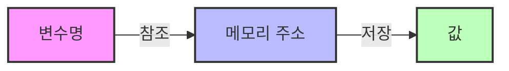
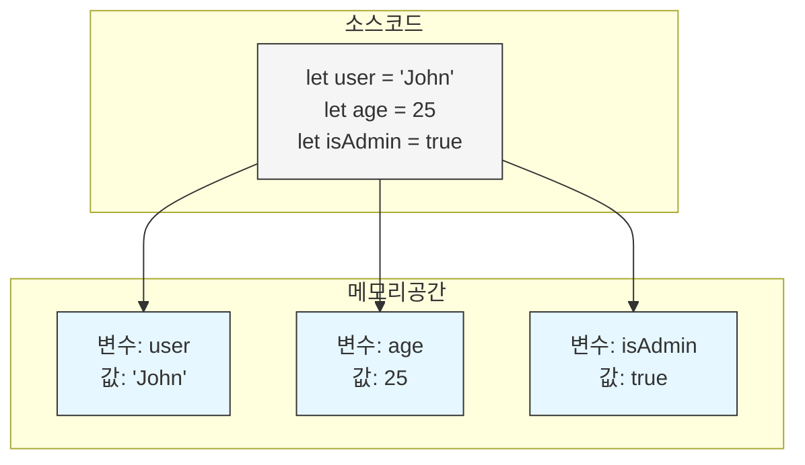
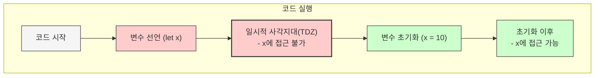
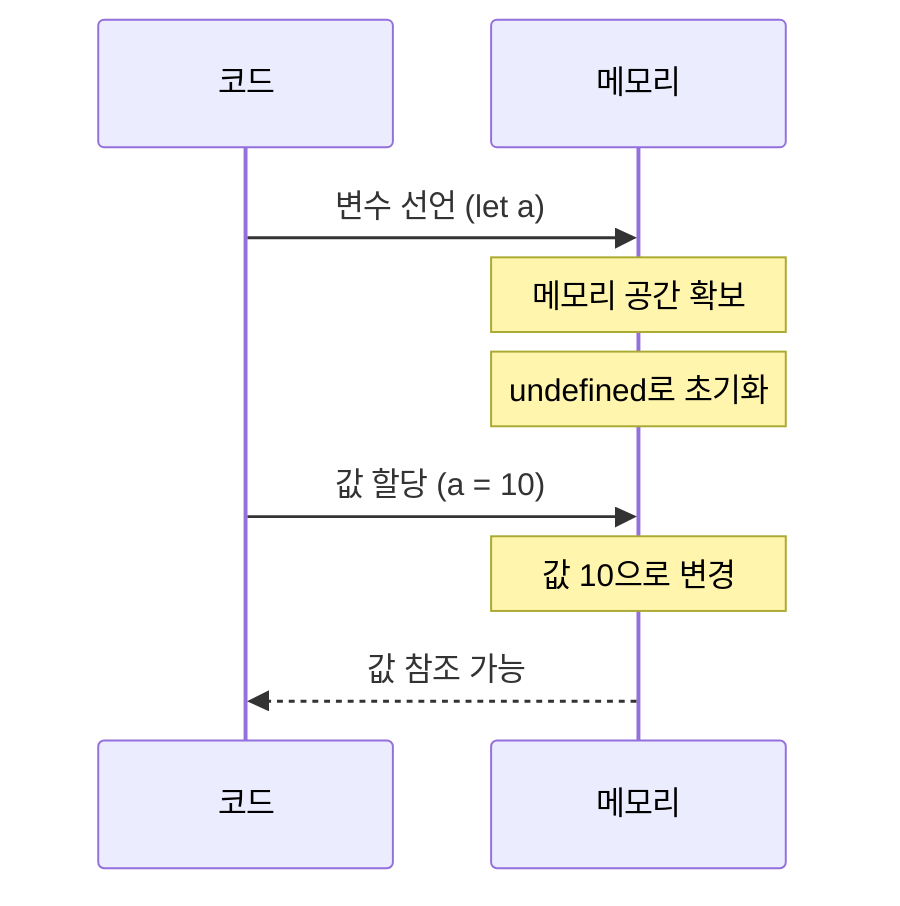
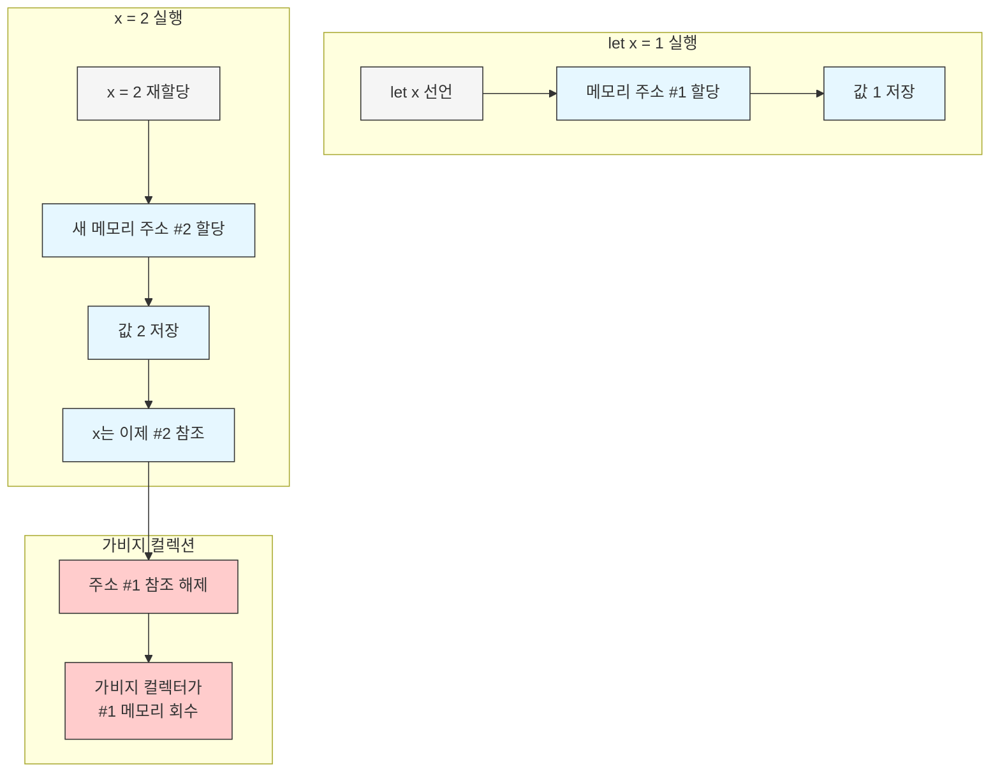

## 4.1 변수란 무엇인가? 왜 필요한가?

### 변수의 정의

> 💡 변수(Variable)는 값을 저장하기 위해 확보한 메모리 공간 자체 또는 그 메모리 공간을 식별하기 위해 붙인 이름
> 

### 왜 변수가 필요할까?

```jsx
// 변수 없이 연산하기
console.log(10 + 20); // 30

// 재사용이 어렵고 값의 의미를 알기 어려움
console.log((10 + 20) * 30); // 900
 
```

```jsx
// 변수 사용하기
const width = 10;
const height = 20;
const area = width * height;

console.log(area); // 200
console.log(area * 30); // 6000

// 값의 의미가 명확해지고 재사용성이 높아짐

```

### 변수와 메모리



1. 변수는 하나의 값을 저장하기 위한 수단
2. 메모리 공간에 값을 저장하고 참조할 수 있는 방법 제공
3. 값의 의미를 명확히 하는 역할

---

## 4.2 식별자

### 식별자란?

> 💡 식별자(Identifier)는 어떤 값을 구별해서 식별할 수 있는 고유한 이름
값이 아닌 메모리 주소를 기억하고 있음
> 

```jsx
// name이 식별자
const name = 'JavaScript';

// age가 식별자
let age = 25;

// 함수 식별자
function add(a, b) {
  return a + b;
}

```

### 식별자의 역할

- 변수, 함수, 클래스 등의 이름으로 사용
- 메모리 주소를 기억하는 대신 식별자로 간편하게 참조
- 코드의 가독성과 유지보수성 향상



---

## 4.3 변수 선언

### 변수 선언이란?

> 💡 변수 선언(Variable Declaration)은 값을 저장하기 위한 메모리 공간을 확보하고, 이름을 붙이는 작업
> 

### 자바스크립트의 변수 선언 키워드

```jsx
// var - ES5 이전의 변수 선언 방식
var oldWay = '예전 방식';

// let - 재할당 가능한 변수
let mutable = '변경 가능';

// const - 재할당 불가능한 상수
const immutable = '변경 불가';

----------------------------

var

특성: 함수 스코프, 호이스팅 시 undefined로 초기화, 재선언/재할당 가능
사용: 레거시 코드, 특별한 함수 스코프 필요 시 (현대 JS에서는 권장 ❌)

let

특성: 블록 스코프, TDZ 적용, 재할당만 가능
사용: 값이 변경되는 변수, 반복문 카운터, 임시 변수

const

특성: 블록 스코프, 선언+초기화 동시에, 재선언/재할당 불가
사용: 상수, 참조 불변 객체/배열, 함수 선언

```

- var를 권장하지 않는 이유
    - **예측하기 어려운 스코프** - var는 함수 스코프만 인식하고 블록 스코프를 무시합니다. 이로 인해 if문이나 for 루프 내에서 선언한 변수가 외부에서도 접근 가능하여 의도치 않은 버그가 발생할 수 있습니다.
    - **호이스팅 동작의 혼란** - var 변수는 호이스팅될 때 undefined로 자동 초기화되어 선언 전에 접근해도 에러가 아닌 undefined를 반환합니다. 이는 디버깅을 어렵게 만듭니다.
    - **재선언 허용으로 인한 문제** - 같은 스코프에서 동일한 변수를 여러 번 선언할 수 있어 실수로 변수를 덮어쓰는 문제가 발생할 수 있습니다.
    - **전역 객체 오염** - 함수 외부에서 선언된 var 변수는 전역 객체(window)의 속성이 되어 전역 네임스페이스를 오염시킵니다.
    - **코드 가독성 및 유지보수성 저하** - var의 이러한 특성들은 코드의 예측 가능성을 떨어뜨리고 디버깅을 어렵게 만듭니다.

### 변수 선언과 초기화 과정

1. **선언 단계**: 변수 이름을 등록하여 자바스크립트 엔진에 변수의 존재를 알림
2. **초기화 단계**: 값을 저장하기 위한 메모리 공간을 확보하고 undefined로 초기화

```jsx
let variable; // 선언과 동시에 undefined로 초기화
console.log(variable); // undefined

variable = 'hello'; // 값의 할당
console.log(variable); // 'hello'
```

---

## 4.4 변수 선언의 실행 시점과 변수 호이스팅

### 변수 호이스팅이란?

> 💡 변수 호이스팅(Variable Hoisting)은 변수 선언문이 코드의 선두로 끌어 올려진 것처럼 동작하는 자바스크립트의 특징
> 

```jsx
// 변수 호이스팅 예제
console.log(hoisted); // undefined (에러가 아님!)
var hoisted = 'value';

// 위 코드는 자바스크립트 엔진에 의해 아래와 같이 해석됨
var hoisted; // 선언이 코드 최상단으로 끌어올려짐
console.log(hoisted); // undefined
hoisted = 'value'; // 할당은 원래 위치에서 실행

```

### var, let, const의 호이스팅 차이

```jsx
// var 호이스팅
console.log(varVariable); // undefined
var varVariable = 'var';

// let 호이스팅 - TDZ(Temporal Dead Zone) 발생
console.log(letVariable); // ReferenceError: letVariable is not defined
let letVariable = 'let';

// const 호이스팅 - TDZ(Temporal Dead Zone) 발생
console.log(constVariable); // ReferenceError: constVariable is not defined
const constVariable = 'const';

```

### 일시적 사각지대(TDZ) - 선언만 되고 아직 초기화 되지 않는 변수가 머무는 공간

변수가 호이스팅 되어 스코프의 시작점에 존재하지만 아직 초기화 되지 않아서, 해당 변수에 접근하려고 하면 참조 불가 에러 발생!



```jsx
// TDZ 예제
// 여기서부터 TDZ 시작
console.log(x); // ReferenceError
let x = 10;     // TDZ 종료, 변수 초기화
console.log(x); // 10 - 정상 접근 가능

```

---

## 4.5 값의 할당

### 값의 할당이란?

> 💡 할당(Assignment)은 변수에 값을 저장하는 과정
> 

```jsx
var a; // 변수 선언
a = 10; // 값의 할당

// 선언과 할당을 동시에
var b = 20;

```

### 값의 할당 과정과 메모리

```jsx
var c = 30;
// 자바스크립트 엔진은 아래와 같이 처리
var c; // 선언: 메모리 공간 확보 후 undefined로 초기화
c = 30; // 할당: 확보된 메모리 공간에 실제 값을 저장
```



### 값의 할당 시점

```jsx
console.log(d); // undefined
var d = 40;
console.log(d); // 40

// 선언은 런타임 이전에 처리되지만, 할당은 런타임에 처리됨

```

---

## 4.6 값의 재할당

### 재할당이란?

> 💡 재할당(Reassignment)은 이미 값이 할당되어 있는 변수에 새로운 값을 저장하는 것
> 

```jsx
// var, let은 재할당 가능
var count = 1;
count = 2; // 재할당

var a = 10;

const test = () => {
   var a = 10; 
}

let score = 80;
score = 100; // 재할당

// const는 재할당 불가
const PI = 3.14;
PI = 3.14159; // TypeError: Assignment to constant variable

```

### 재할당과 메모리



```jsx
let x = 1; // 메모리 주소 #1에 1 저장
x = 2;     // 새로운 메모리 주소 #2에 2 저장, x는 #2를 참조
// #1의 값은 가비지 컬렉터에 의해 나중에 메모리에서 해제됨

```

### 가비지 컬렉션

- 자바스크립트는 가비지 컬렉터를 내장하여 메모리 관리를 자동화
- 참조되지 않는 메모리 영역을 탐지하고 해제

---

## 4.7 식별자 네이밍 규칙

### 기본 규칙

1. 식별자는 문자, 달러 기호($), 밑줄(_)로 시작해야 함
2. 이후는 숫자도 포함 가능
3. 예약어는 식별자로 사용할 수 없음

```jsx
// 유효한 식별자 예시
let validName;
let $price;
let _value;
let camelCase;
let PascalCase;
let item1;

// 유효하지 않은 식별자 예시
let 1item;     // 숫자로 시작 불가
let my-name;   // 특수문자 사용 불가($ _ 제외)
let var;       // 예약어 사용 불가

```

### 네이밍 컨벤션

> 💡 네이밍 컨벤션은 가독성과 유지보수성을 높이기 위한 식별자 작성 규칙
> 

```jsx
// 카멜 케이스(camelCase) - 변수, 함수에 주로 사용
let firstName = 'John';
let backgroundColor = '#fff';
function calculateTotal() {}

// 파스칼 케이스(PascalCase) - 생성자 함수, 클래스에 주로 사용
class User {}
function Person() {}

// 스네이크 케이스(snake_case)
let user_id = 1;
const max_size = 100;

// 상수는 대문자 스네이크 케이스로 표현하는 경우가 많음
const API_KEY = 'abcd1234';
const MAX_POOL_SIZE = 100;

```

### 의미 있는 이름 사용하기

```jsx
// 좋지 않은 예
let a = 10;
let b = 20;
let c = a * b;

// 좋은 예
let width = 10;
let height = 20;
let area = width * height;

```

---

## 정리: 변수 사용 시 주의사항

1. **적절한 변수 선언 키워드 사용**
    - 재할당이 필요한 경우: `let`
    - 상수: `const` (권장)
    - `var`는 가급적 사용 지양
2. **변수 스코프 이해하기**
    - 전역 변수 최소화
    - 블록 스코프 활용
3. **의미 있는 이름으로 네이밍**
    - 명확한 목적을 담은 이름
    - 일관된 네이밍 컨벤션 사용
4. **변수 호이스팅 주의**
    - 선언 전 변수 사용 지양
    - TDZ 이해하기
5. 다음주는 스코프에 대해서..